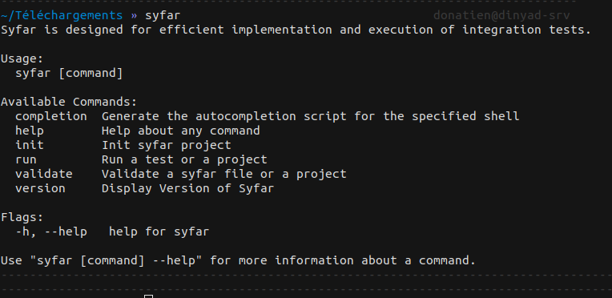
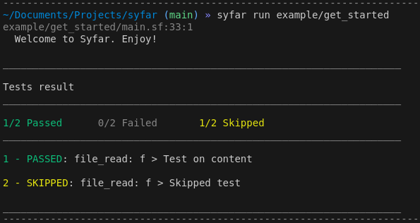
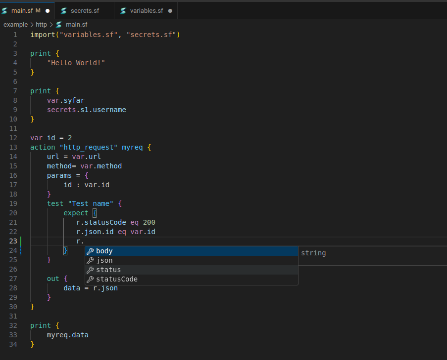

# Syfar 
<p align="center">
  
</p>

[WIP]
Syfar is a declarative language designed for the efficient implementation and execution of integration tests. It aims to simplify the process of testing large systems by providing a straightforward and flexible testing framework.

## Features
- **Declarative language** for test descriptions
- **Supports multiple action providers** including:
  - File provider: Allows reading file content for testing or reuse in subsequent actions
  - HTTP provider: Enables testing HTTP endpoints and interactions

- **Custom action providers**: Extend Syfar with your own providers, with planned support for Kafka, database interactions, and more. Currently, adding a new provider requires rebuilding Syfar, but we are working on future support for providers through the **Go plugin system over RPC** to enable dynamic extension without a rebuild.
  
- **Simple CLI commands** to initialize, validate, and run tests
- **Support for multiple Linux distributions** (Debian, RPM, APK packages)
- **Syfar Language Server** for IDE integration, providing real-time validation, autocompletion, and error diagnostics (refer to  [https://github.com/dinyad-prog00/syfar-ls](https://github.com/dinyad-prog00/syfar-ls)) [WIP]
- **VSCode extension** for syntax highlighting and integration


## Installation

### From Precompiled Binaries

You can download the precompiled binaries for your Linux distribution from the [releases page](https://github.com/dinyad-prog00/syfar/releases).

For example, to install on an AMD64 Debian-based system:

```bash
wget https://github.com/dinyad-prog00/syfar/releases/download/0.1.0/syfar_0.1.0_linux_amd64.deb
sudo dpkg -i syfar_0.1.0_linux_amd64.deb
```

Alternatively, you can install from source:

### From Source

```bash
git clone https://github.com/dinyad-prog00/syfar.git
cd syfar/cli
go build -o ../build/syfar
```

## Usage

Syfar provides several commands to help you manage and execute your integration tests.



### Initialize a Project

To create a new Syfar project, run:

```bash
syfar init 
```

This command will scaffold a new Syfar project in the current directory. You can use `syfar init my_project` for new folder creation.

### Run a Test or Project

You can run individual tests or entire projects using the `run` command. For example:

```bash
syfar run example/get_started
```



### Validate a Test

Before running a test, it's a good idea to validate it to ensure there are no syntax or structural errors:

```bash
syfar validate example/test.sf
```


## VSCode Integration



Syfar has a VSCode extension that provides syntax highlighting and language support for `.sf` files. 

You can install the VSCode extension by downloading the `.vsix` file from [here](highlighting/vscode/syfar-0.0.2.vsix), and then installing it manually in VSCode:

1. Open VSCode.
2. Go to the Extensions view.
3. Click on the ellipsis (`...`) in the top-right corner and select **Install from VSIX**.
4. Choose the downloaded `syfar-0.0.2.vsix` file.

This extension integrates seamlessly with the Syfar Language Server, providing real-time validation, autocompletion, and error diagnostics.

## Contributing

We welcome contributions! Here's how you can contribute:

1. Fork the repository.
2. Create a new branch (`git checkout -b feature/your-feature`).
3. Make your changes.
4. Submit a pull request with a detailed explanation of your changes.

Please make sure to follow the coding standards and test your changes before submitting. `CONTRIBUTING.md` will be added.

## License

Syfar is open-sourced software licensed under the [Apache License](LICENSE).
